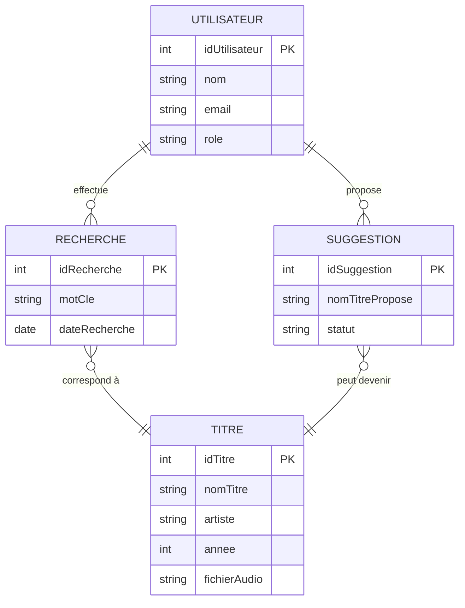

#  Pandoré  
*(Contraction de Pandore et les notes Do & Ré)*  

##  Description du projet
**Pandoré** est une **banque de musique en ligne** avec un principe simple :  
L’utilisateur utilise une **invite vocale ou textuelle** pour rechercher un titre.  

- Si le titre est trouvé → il est affiché directement.  
- Si une correspondance approximative existe → plusieurs titres proches sont proposés.    

##  Technologies utilisées
- **Frontend** : HTML, CSS, JavaScript  
- **Backend** : PHP  
- **Base de données** : MySQL  
- **Échange de données** : JSON  
- **Omeka S** : pour la gestion et la récupération des fichiers audio  
- **Hébergement & versioning** : GitHub  

##  Fonctionnalités principales
- Recherche vocale ou textuelle d’un titre  
- Affichage des résultats exacts ou proches  

##  Modèle de données : Diagramme Entité-Relation
Voici l’ERD (Entité-Relation) du projet Pandoré :  

## Prompt utilisé pour le diagramme

### Chat OpenAI

J'aurais besoin que tu m'intégre un diagramme "entité relation" correspondand à mon projet fait avec mermaid. 
Voici mon projet : 

Pandoré (Contraction de Pandore et les notes Do & Ré) 
Banque de musique 

Pandoré serait une banque de musique en ligne qui a un principe très simple, l’utilisateur utilisera l’invite vocal pour chercher le son d’un titre avec le titre ou un bout du titre et le site lui proposera tous les titres qui s’en rapproche dans ce cas là. 

Par exemple, une personne qui cherchera Walk a Like an Egyptian pourra soit donner le nom complet dans ce cas le site lui donnera directement la musique ou dans le cas contraire proposera tous les titres qui s’en rapproche. 
Dans le cas où un titre n’est pas disponible, l'utilisateur aura la possibilité de proposer le nom du titre qui pourra être rajouté ultérieurement par le gérant du site. 

Elle sera codée en HTML, CSS, JS utilisant du PHP et une BDD MySQL. Pour le côté donné et multimédia du JSON/XML sera utilisé. Le projet sera stocké sur GitHub. Omeka S sera aussi utilisé notamment pour récupérer l’audio.
