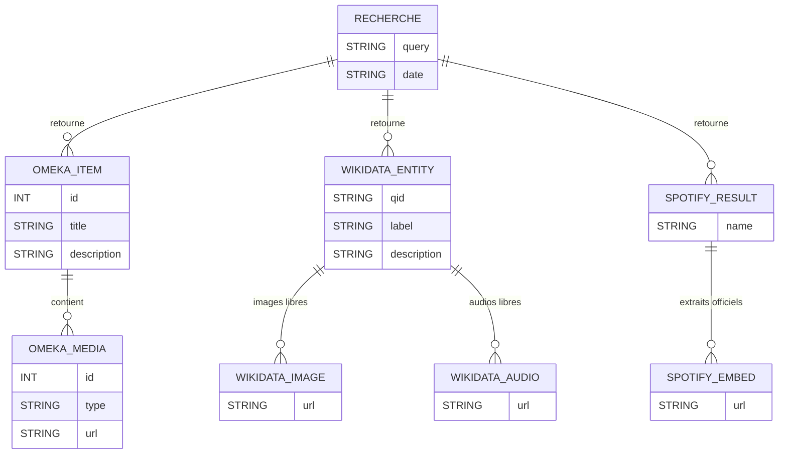

# Pandoré  
#### (Recherche multimédia : Omeka S + Wikidata + Spotify + Jamendo)

Pandoré est un module conçu pour Omeka S permettant d’effectuer une recherche unifiée dans plusieurs sources :

- **Omeka S** : recherche dans les items existants  
- **Wikidata** : récupération d’informations, images et fichiers audio libres de droits  
- **Spotify** : affichage légal d’extraits officiels via un iframe embed
- **Jamendo** : affichage non officiels des extraits (avec possibilité de les téléchargés)  

Il inclut également une **API HTML externe (apiOmk.html)** permettant :
- de lire les items Omeka S  
- de créer un item  
- d’uploader un média lié à cet item  
- d’afficher le module Pandore dans un *iframe* en bas de page.

---

##  Fonctionnalités principales

###  1. Recherche centralisée
L'utilisateur saisit un nom (artiste, œuvre, personnage…).  
Le module interroge automatiquement :

| Source | Type de résultats |
|-------|-------------------|
| **Omeka S** | Items internes |
| **Wikidata** | Label, description, images (P18), audios libres (P85) |
| **Spotify** | Extraits musicaux officiels en iframe |
| **Jamendo** | Extraits musicaux non officiels |

Toutes les données sont affichées proprement dans `index.phtml`.

---

##  2. API externe (apiOmk.html)

Cette page HTML incluse dans le module permet via JavaScript natif :

- d’afficher les items Omeka S  
- de créer des items  
- d’uploader des images ou fichiers audio  
- **d’embarquer l’interface du module Pandore dans un iframe**

Elle sert d’outil externe simple pour tester l’API native d’Omeka S.

---

##  Modèle de données : Diagramme Entité-Relation

## Prompt utilisé pour le diagramme

### Chat OpenAI

J'aurais besoin que tu m'intégre un diagramme "entité relation" correspondand à mon projet fait avec mermaid. 
Voici mon projet : 

# Pandoré  
Recherche multimédia : Omeka S + Wikidata + Spotify

Pandore est un module conçu pour Omeka S permettant d’effectuer une recherche unifiée dans plusieurs sources :

- Omeka S : recherche dans les items existants  
- Wikidata : récupération d’informations, images et fichiers audio libres de droits  
- Spotify : affichage légal d’extraits officiels via un iframe embed  
- Jamendo : affichage non officiels des extraits (avec possibilité de les téléchargés)  

Il inclut également une API HTML externe (apiOmk.html) permettant :
- de lire les items Omeka S  
- de créer un item  
- d’uploader un média lié à cet item  
- d’afficher le module Pandore dans un *iframe* en bas de page.

